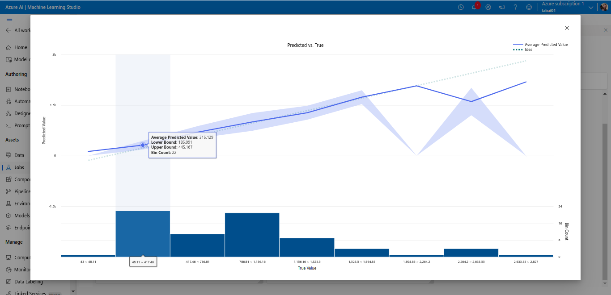
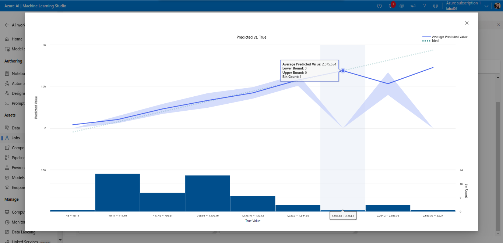
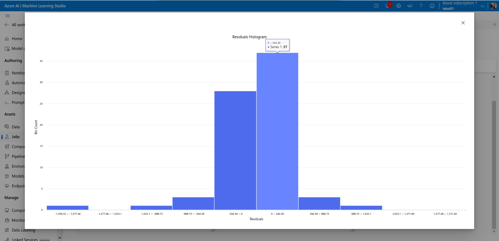

# Aprofundando no Lab Project 01 - Microsoft Azure AI Fundamentals

> Originalmente postado no Fórum do Bootcamp na plataforma da DIO.

Se você também ficou curioso com alguns detalhes do primeiro Lab Project, esse é o lugar para ir mais a fundo no que foi trabalhado. 

Enquanto eu realizava o laboratório, surgiram diversas dúvidas quanto a termos e informações mostradas na plataforma, resultados e configurações. Esse tópico é uma tentativa de explicar um pouco do que fui aprendendo enquanto buscava mais informações sobre.

Sabe de alguma informação interessante que não foi incluída aqui? Adicione nos comentários! Vamos compartilhar o conhecimento e aprender juntos! 

Se encontrou algum erro no que escrevi, por favor comente. As informações passadas aqui foram o melhor que consegui com buscas na documentação e na internet. 

## Contexto
Suponha que o seu Zé possui um estabelecimento de aluguel de bicicletas. Suponha também que as bicicletas que seu Zé aluga ficam armazenadas em um galpão empoeirado e todo dia de manhã ele vai até esse galpão, seleciona uma quantidade de bicicletas, limpa-as e leva para seu estabelecimento de aluguel para expor-las brilhantes e atraentes para seus clientes. Contudo, há dias que a demanda por bicicletas é tão grande que seu Zé precisa correr ao depósito e buscar mais bicicletas. Em outros dias, o movimento é fraco e muitas das bicicletas que trouxe sequer são usadas, o que é um desperdício do tempo que ele usou para limpá-las. Ambas as situações poderiam ser resolvidas se seu Zé pudesse **prever** ou soubesse uma **estimativa** de quantas bicicletas seriam requisitadas naquele dia. 

Esse desafio se propõe a usar **machine learning** de forma automatizada através da plataforma **Azure Machine Learning** para inferir, ou prever, (predict) a quantidade de aluguéis de bicicletas que serão esperados em um determinado dia.

## Dados
Os dados usados para treinamento são um histórico de informações meteorológicas e de temporada sobre o dia do aluguel, combinados com quantidade de bicicletas alugadas. As informações específicas estão listadas abaixo (em português está descrito o que acredito significar cada uma): 

- day: dia
- mnth: mês
- year: ano
- season: estação
- holiday: se o dia é feriado ou não
- weekday: se é dia da semana ou fim de semana
- workingday: se é um dia útil ou não
- weathersit: ?  
- temp: temperatura do dia
- atemp: ?
- hum: humidade do ar
- windspeed: velocidade do vento
- Rentals: (target) quantidade de aluguéis de bicicleta do dia. 

O modelo aprende com essas informações (treinamento) a fim de ser capaz de inferir sobre novos casos. É importante lembrar que a informação "Rentals" é o target ou label do conjunto de dados, ou seja, é o valor que o modelo de IA tentará prever após ser treinado. É o que provê o que é chamado de ground truth, o que significa que é por meio dele que é possível avaliar a performance do modelo treinado. 

## Metodologia - Automated Machine Learning
O método de automação usado nesse exercício consiste em "testar múltiplos algoritmos e parâmetros para testar múltiplos modelos". Ao final, o melhor modelo é escolhido para lidar com a inferência de novos dados. A plataforma fornece todo o pipeline (estrutura automatizada que define o fluxo de treinamento dos modelos), cabendo a nós apenas algumas configurações. 

Abaixo algumas que achei interessante pesquisar ou citar: 

- **Select task type:** Regression. O tipo de tarefa a ser executada. Como desejamos estimar um número e não uma classe, ou seja, a quantidade de bicicletas, utilizaremos Regressão.
- **Primary metric:** Normalized root mean squared error. De forma simplificada, é a métrica usada para avaliar a performance do modelo. Normalized vem de sua capacidade de lidar com predições em diferentes escalas. É uma expansão de outra métrica comumente usada para medir a magnitude média dos erros entre os valores preditos e reais.
- **Allowed models:** RandomForest and LightGBM. Estes são os modelos de machine learning propriamente ditos. São estes dois que são testados com múltiplos parâmetros a fim de verificar qual é o melhor para lidar com os dados do problema. 
- **Validation type:** Train-validation split. De maneira simplificada, é uma técnica utilizada para avaliar a performance e capacidade do modelo de generalizar dados novos e calibrar os parâmetros dos modelos. Ou seja, de verificar se o modelo consegue usar o que aprendeu para inferir sobre dados que nunca viu e ajustar o modelo conforme sua performance durante o treinamento.

## Resultados 
O exercício nos propõe gerar dois gráficos: **residuals** e **predict_true**.

### predict_true
De acordo com a descrição do próprio exercício, esse gráfico compara os valores preditos com os valores reais.

**Descrição dos elementos do gráfico:**
- **Linha contínua:** mostra a média dos valores (no eixo y) que o modelo inferiu para a faixa de valores reais do eixo x. Ou seja, para a coluna destacada na figura acima, o número de biciletas dos dados reais estava entre 185 e 445, enquanto o modelo previu casos cuja média é 315. 
- **Linha pontilhada:** o valor real (no eixo y) dos casos dentro do intervalo do eixo x. 
- **Sombras sob as linhas:** representam a região entre o upper bound e lower bound. Uma forma de estimar o intervalo onde os novos dados vão ser inferidos.
- **Histograma:** contagem de pontos inferidos de dados que se enquadram em cada intervalo (bin) de previsões. 

### residuals
Histograma que representa a diferença entre o predito e os valores reais.

Um Residual Histogram exibe a frequência dos valores residuais no eixo y e os próprios valores residuais, ou seja, a diferença entre o valor predito e o valor real, no eixo x. Ele usa barras verticais para representar o número de pontos de dados que se enquadram em intervalos específicos de valores residuais. Ou seja, de acordo com a imagem acima, isso significa que 36 casos tiveram previsões que divergiram do valor real numa magnitude entre 0 e 344, por exemplo.  

Além disso, um Residual Histogram simétrico e em forma de sino centrado em torno de zero é geralmente considerado um sinal positivo, sugerindo que as suposições do modelo sobre os resíduos são provavelmente atendidas. Histogramas com outra forma podem indicar possíveis problemas com o modelo ou com os dados que precisam de investigação adicional.

> Isso é tudo, pessoal! Espero que esse material tenha sido útil de alguma forma! (:

