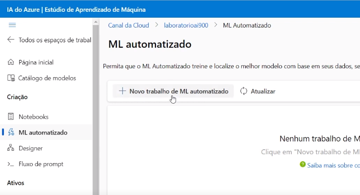
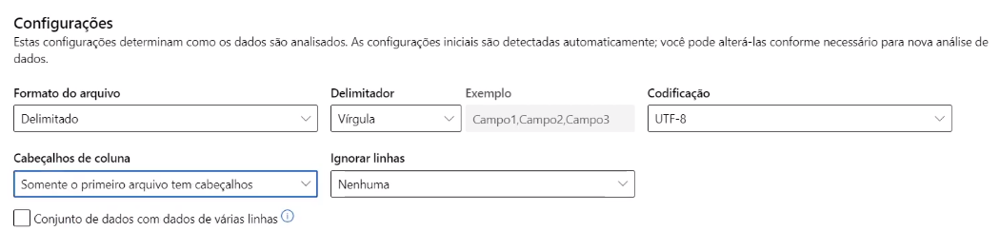
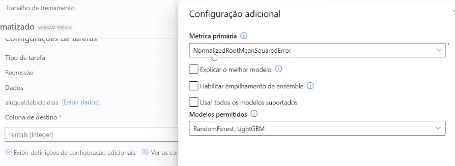
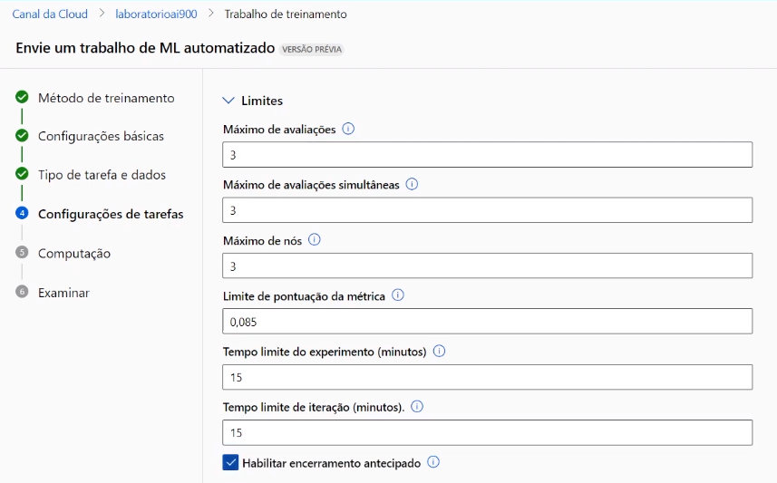
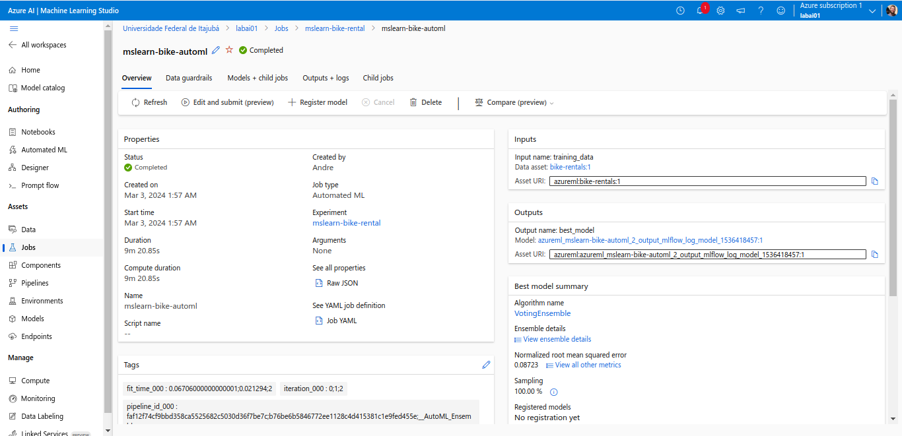
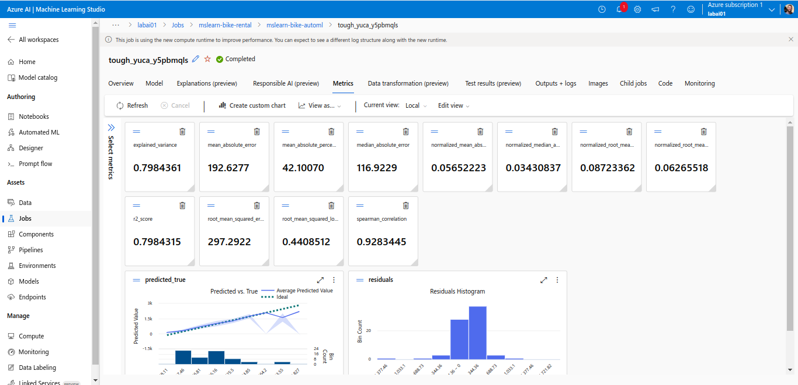
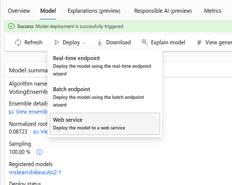
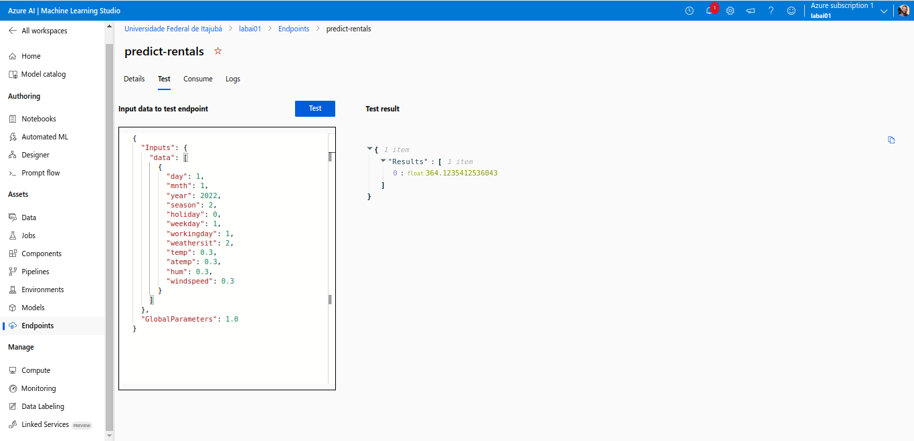

# Lab Project 01 - Trabalhando com ML na prática no Azure ML

O objetivo desse laboratório é usar **machine learning** de forma automatizada através da plataforma **Azure Machine Learning** para inferir, ou prever, (predict) a quantidade de aluguéis de bicicletas que serão esperados em um determinado dia.

> Mais informações sobre a o problema podem ser lidas no arquivo `AprofundamentoNoLabProject01.md`.

Esse experimento é baseado no guia *"Explore Automated Machine Learning in Azure Machine Learning"* disponível [aqui](https://microsoftlearning.github.io/mslearn-ai-fundamentals/Instructions/Labs/01-machine-learning.html).

## Criar um workspace no Azure Machine Learning
Para ser possível usar o Azure Machine Learning é essencial que você possua um workspace para a plataforma associado a sua conta Azure. Isso pode ser feito por meio dos seguintes passos:
1. Acessar https://portal.azure.com
2. Criar novo recurso Azure Machine Learning através da opção Create Resource
3. Acessar o workspace no Azure Machine Learning Studio (https://ml.azure.com)

## Usar automate machine learning para treinar um modelo
Dentro do Azure Machine Learning Studio, podemos selecionar o serviço Automated ML e criar um novo automated job.

### Configuração do treinamento de do conjunto de dados

Feito isso é preciso preencher algumas configurações básicas como nome do trabalho, novo nome do experimento, descrição e tags.
O tipo de tarefa realizada nesse exercício é uma **Regressão**, utilizando um conjunto de dados do tipo **tabular** disponível via Web URL [aqui](https://aka.ms/bike-rentals).

Demais configurações para o conjunto de dados que determinam como serão analisados podem ser vistas na imagem abaixo.

O restante da configuração do conjunto de dados não precisa ser alterado e pode ser deixado nas predefinições padrão. 

### Configuração de tarefas

Nessa etapa é preciso selecionar a coluna do *target*, ou *label*, que neste caso é a coluna "Rentals". Além disso, é preciso alterar algumas configurações adicionais, que podem ser vistas na figura abaixo.

É importante ficar atento nesse passo à seleção da métrica primária, onde é usado **NormalizedRootMeanSquredError** (NRMSE), e à seleção dos modelos. Nesse exercício foram usado **RandomForest e LightGBM**.

A próxima etapa é determinar os limites das configurações de tarefas:

Feito isso, é preciso selecionar o tipo de validação a ser usado. Nesse experimento foi usado "Divisão de validação de treinamento" (*Train-validation split*) com 10% de dados para validação e nenhum dado de teste.

Por fim, as configurações de computação foram mantidas no padrão sugerido pela plataforma. Após essas etapas é posssível enviar o trabalho de treinamento.

Mais detalhes das configurações do treinamento podem ser encontradas no guia citado na introdução deste arquivo. 

## Verificar melhor modelo
Uma vez concluído o treinamento é possível verificar os resultados e validar métricas do melhor modelo. Basta clicar no texto em azul abaixo de Algorithm Name (Nome do Algoritmo).

Ao acessar a aba Métricas, temos acesso a diversos indicadores da performance do modelo, como r2_score e o próprio NNRMSE. Além disso, é possível visualizar dois gráficos: Predicted vs True, que compara os valores preditos com os valores reais, e Residuals Histogram, que é um histograma que representa a diferença entre o predito e os valores reais.

> Mais informações sobre os gráficos podem ser lidas no arquivo `AprofundamentoNoLabProject01.md`.

## Deploy e teste do modelo
A partir da aba Modelo (Model), é possível realizar o *deploy* e realizar algumas inferências a fim de testar o serviço. Basta selecionar Deploy > Web service, e configurar uma instância de um container Azure para lidar com os *requests*.

Uma vez que o *deploy* foi feito é possível acessar o **Endpoint** no menu da esquerda e inserir o arquivo .json com o caso a ser inferido.

O resultado do painel da esquerda mostra a predição da quantidade de biciletas requisitadas para o dia especificado. 

> Mais informações sobre detalhes técnicos e gráficos podem ser lidas no arquivo `AprofundamentoNoLabProject01.md`.

